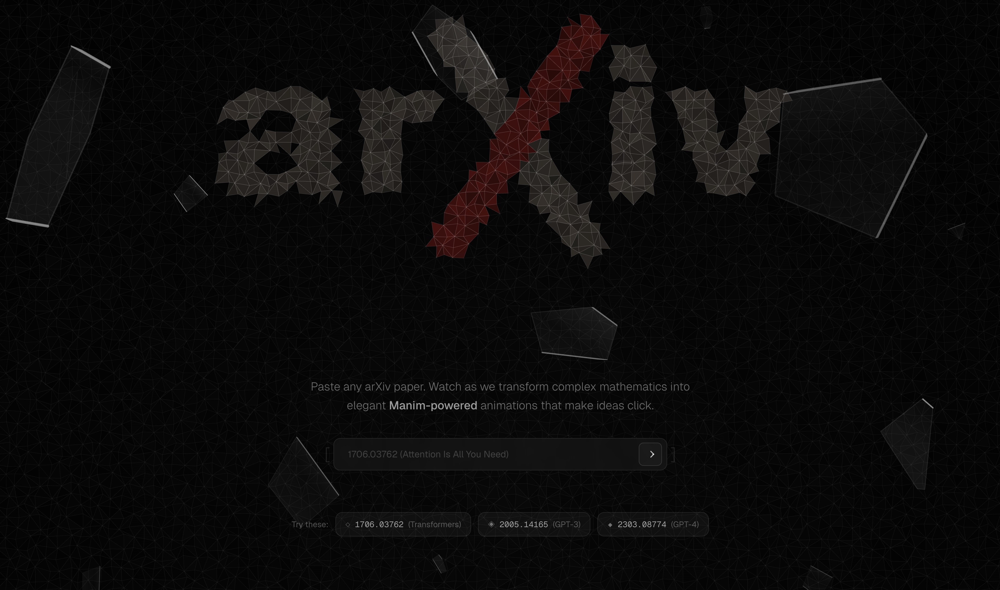
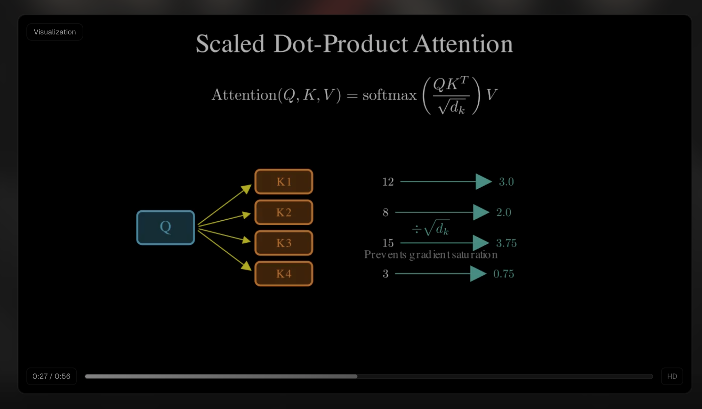

<div align="center">
    
</div>
<h1 align="center">
  Explorion
</h1>
<p align="center">
   Transform research papers, GitHub repositories, and technical content into visual stories
</p>

[](https://github.com/user-attachments/assets/5453760b-5f82-4fd1-9a77-fe8818fea059)





## How It Works

1. **Ingest**: Paste any arXiv paper, GitHub repository, or technical article URL and watch as it's decomposed into digestible sections
2. **Analyze**: AI agents analyze each section to identify key concepts and visual opportunities
3. **Generate**: Multi-agent pipeline creates 3Blue1Brown-style Manim animations for complex ideas
4. **Validate**: Four-stage quality gates ensure syntactic correctness, spatial coherence, and runtime stability
5. **Experience**: Read through an interactive scrollytelling interface with embedded animated visualizations

---

## Technical Architecture

Explorion consists of two main parts:
- **Backend (Python)**: Uses FastAPI, `uv` for dependency management, Dedalus SDK for AI orchestration, and Manim for video generation.
- **Frontend (Node.js)**: A Next.js 15 application utilizing Tailwind CSS and shadcn/ui.

---

## Detailed Local Setup

Follow these steps to run Explorion on your local machine.

### 1. Prerequisites

You must have the following system dependencies installed before running the project:

- **Node.js** (v18 or higher)
- **Python** (v3.11 or higher)
- **uv**: The fast Python package installer (`pip install uv` or natively via curl/powershell)
- **Manim Engine Dependencies:** (FFmpeg, Cairo, Pango)
  - **Windows**: Use [Chocolatey](https://chocolatey.org/) (`choco install ffmpeg pango cairo`) or install them manually and add to PATH. Alternatively, follow [Manim's Windows Guide](https://docs.manim.community/en/stable/installation/windows.html).
  - **macOS**: `brew install ffmpeg cairo pango pkg-config`
  - **Linux (Ubuntu/Debian)**: `sudo apt install ffmpeg libcairo2-dev libpango1.0-dev pkg-config`

### 2. Backend Setup

The backend handles AI generation, web scraping, and Manim video rendering.

1. Navigate to the backend directory:
   ```bash
   cd backend
   ```
2. Set up environment variables:
   ```bash
   cp .env.example .env
   ```
   Open the newly created `.env` file and **add your API keys**:
   - `DEDALUS_API_KEY`: Required for the LLM agents to function. Get it from [Dedalus Labs](https://www.dedaluslabs.ai/dashboard/api-keys).
   - `GITHUB_TOKEN`: (Optional but recommended) For scraping GitHub repositories without hitting API rate limits.
   - `TTS_PROVIDER`: Set to `gtts` for free TTS, or configure `openai` / `elevenlabs` if you have keys.

3. Install Python dependencies using `uv`:
   ```bash
   uv sync
   ```
   *(This will automatically create a virtual environment and install all requirements from `uv.lock` / `pyproject.toml`)*

4. Start the FastAPI backend server:
   ```bash
   uv run uvicorn main:app --reload --host 0.0.0.0 --port 8000
   ```
   The API will now be running at `http://localhost:8000`.

### 3. Frontend Setup

The frontend provides the interactive scrollytelling interface.

1. Open a **new terminal tab/window** and navigate to the frontend directory:
   ```bash
   cd frontend
   ```
2. Set up frontend environment variables:
   ```bash
   cp .env.local.example .env.local  # If the example file exists
   ```
   *Ensure inside `.env.local` that `NEXT_PUBLIC_API_URL` points to your backend (default is `http://localhost:8000`). If you want to bypass the backend for frontend UI testing, you can set `NEXT_PUBLIC_USE_MOCK=true`.*

3. Install Node dependencies:
   ```bash
   npm install
   ```

4. Start the frontend development server:
   ```bash
   npm run dev
   ```
   The UI will now be running at `http://localhost:3000`.

### 4. Running Your First Project

1. Open your browser and navigate to `http://localhost:3000`
2. Enter an arXiv URL (e.g., `https://arxiv.org/abs/2508.12111`) or a GitHub repository link.
3. Wait as the multi-agent system fetches the text, writes the Manim scripts, and renders the videos. (Monitor your backend terminal for processing logs and any rendering errors).

---

## Inspiration

Research papers and complex technical documentation often arrive as monoliths — dense, opaque, intimidating. Within them lies a mosaic of brilliant ideas waiting to be seen.

<<<<<<< HEAD
**Explorion** transforms fragments of academic text and technical content into animated visual explanations, making complex research and codebases accessible to everyone.
